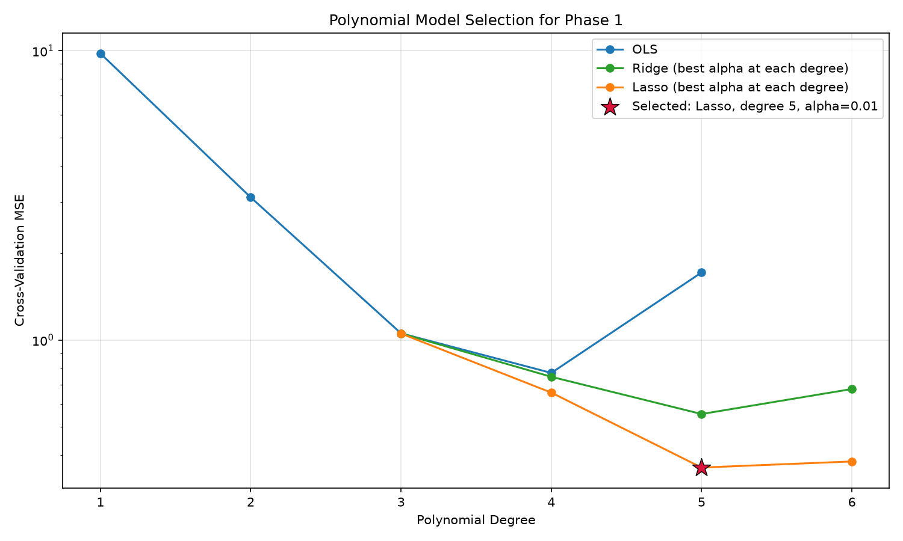
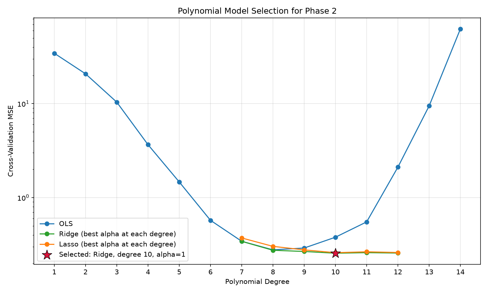

# Machine Learning Assignment: Polynomial Regression
**Name:** Abdul Rehman Farooqui  
**Roll Number:** BT2024206  
**GitHub Repository:** [https://github.com/ARF9792/ML-Assignment](https://github.com/ARF9792/ML-Assignment)  

---

## 1. Introduction
This assignment requires polynomial regression models for two personalized datasets. Phase 1 predicts a Net Power Score from six steam-turbine operating variables, while Phase 2 predicts a Thermal Anomaly Score from three spatial coordinates. The main modelling challenge is controlling the rapid growth in polynomial terms while selecting a degree that generalizes to unseen test data.

The final solutions remain polynomial regression models: the input variables are expanded into total-degree polynomial terms and a linear model is fitted to those terms. Ridge and Lasso regularization are used only to control the polynomial coefficients.

---

## 2. Methodology

### 2.1. Model Pipeline and Scaling
Every candidate was implemented as a Scikit-Learn `Pipeline` containing:

1. `PolynomialFeatures(degree=d, include_bias=False)`
2. `StandardScaler()`
3. `LinearRegression`, `Ridge`, or `Lasso`

Polynomial terms can have very different scales and are strongly correlated. Standardizing the expanded terms improves numerical conditioning and ensures that Ridge and Lasso penalize coefficients comparably. Because scaling occurs inside the pipeline, its mean and variance are learned only from the training portion of each cross-validation fold, preventing data leakage.

### 2.2. Cross-Validation and Metrics
Model selection used shuffled 5-fold cross-validation with `random_state=42`. Mean Squared Error (MSE) was the primary selection metric, with the coefficient of determination ($R^2$) reported as a supporting metric. The candidate with the lowest mean validation MSE was selected and then retrained on all 1,000 training observations.

To test whether the choice depended excessively on one split, the selected regularized model and the best ordinary least-squares (OLS) model were also evaluated using five different shuffled 5-fold partitions (`0, 1, 7, 21, 42`). The mean and standard deviation across these five runs are reported as a robustness check.

### 2.3. Degree Search and Complexity Control
With 1,000 observations, a 5-fold training partition contains 800 observations. For $p$ inputs and degree $d$, the number of fitted parameters, including the intercept, is

$$N_{parameters} = {p+d \choose d}.$$

The OLS degree sweep stops before the parameter count reaches 800 because the fold-level least-squares problem would otherwise be underdetermined. This gives degrees 1-5 for var1 and 1-14 for var2. Regularization can stabilize larger expansions, so Ridge and Lasso were evaluated in a focused region around the OLS minimum: degrees 3-6 for var1 and 7-12 for var2.

### 2.4. Regularization Search
Ridge applies an L2 penalty that shrinks correlated polynomial coefficients, while Lasso applies an L1 penalty that can set unnecessary coefficients exactly to zero. The following fixed grids were evaluated:

* **var1 Ridge:** $\alpha \in \{0.01, 0.1, 1, 10, 100\}$
* **var1 Lasso:** $\alpha \in \{0.003, 0.01, 0.03, 0.1\}$
* **var2 Ridge:** $\alpha \in \{0.01, 0.1, 1, 10, 100\}$
* **var2 Lasso:** $\alpha \in \{0.001, 0.003, 0.01\}$

This two-stage procedure compares unregularized and regularized polynomial regression without selecting a model from an unnecessarily large, unstable search space.

---

## 3. Phase 1: Steam Turbine Optimization (var1)

### 3.1. Model Selection
The best unregularized model used degree 4. Degree 5 reduced training error but increased validation error, indicating variance from the 461 polynomial terms. Regularization made the degree-5 representation useful.

**Best candidate from each model family:**

* **OLS:** degree 4, validation MSE = 0.769377, validation $R^2$ = 0.929477
* **Ridge:** degree 5, $\alpha=10$, validation MSE = 0.554625, validation $R^2$ = 0.949317
* **Lasso:** degree 5, $\alpha=0.01$, validation MSE = **0.362188**, validation $R^2$ = **0.966917**

Lasso degree 5 achieved the lowest validation MSE and was selected. Across the five repeated cross-validation partitions, OLS degree 4 obtained MSE $0.766723 \pm 0.040933$, while the selected Lasso model obtained $0.360038 \pm 0.002552$. This is a 53.0% reduction in repeated-CV MSE and is consistent across the tested partitions.

### 3.2. Final Fit
The selected degree-5 Lasso model was trained on all training observations. Its final training MSE was **0.262973** and its training $R^2$ was **0.976291**. The lower but nearby validation performance indicates controlled regularization rather than an exact interpolation of the training data.

---

## 4. Phase 2: Thermal Reservoir Mapping (var2)

### 4.1. Model Selection
The unregularized validation error reached its minimum at degree 8 and then increased as polynomial complexity grew. Ridge allowed a degree-10 model to use the additional terms without the sharp variance increase of OLS.

**Best candidate from each model family:**

* **OLS:** degree 8, validation MSE = 0.277910, validation $R^2$ = 0.993926
* **Ridge:** degree 10, $\alpha=1$, validation MSE = **0.255827**, validation $R^2$ = **0.994409**
* **Lasso:** degree 10, $\alpha=0.001$, validation MSE = 0.259085, validation $R^2$ = 0.994365

Ridge degree 10 achieved the lowest validation MSE and was selected. Across the five repeated cross-validation partitions, OLS degree 8 obtained MSE $0.279489 \pm 0.003777$, while the selected Ridge model obtained $0.251989 \pm 0.003396$. The 9.8% reduction is smaller than for var1 but remains consistent across the tested partitions.

### 4.2. Final Fit
The selected degree-10 Ridge model was trained on all training observations. Its final training MSE was **0.170323** and its training $R^2$ was **0.996398**.

---

## 5. Conclusion
Cross-validation selected different regularization strategies for the two personalized datasets:

* **Phase 1:** degree-5 polynomial with Lasso, $\alpha=0.01$
* **Phase 2:** degree-10 polynomial with Ridge, $\alpha=1$

Regularization reduced repeated-cross-validation MSE by 53.0% for var1 and 9.8% for var2 relative to the best unregularized polynomial models. Both improvements were stable across five shuffled cross-validation partitions. The final models were retrained on the complete training datasets and used to generate the submitted test predictions.
